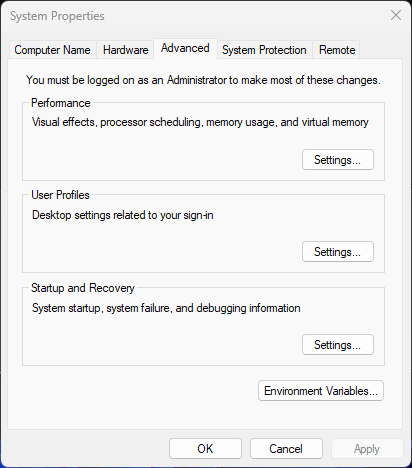
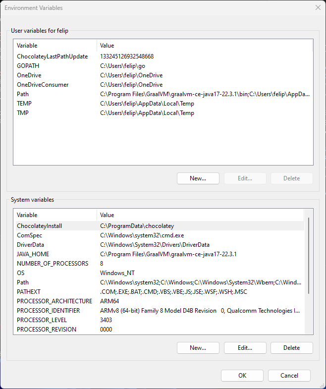

## Workshop Setup for Windows Users

### Java
You will need Java 17 with GraalVM to run this workshop.
Optionally, you can also use Java 8 with earlier parts of the workshop as long as you can switch to Java 17 easily.

We recommend using CHOCOLATEY! to manage installed Java versions, but you're free to use whatever you prefer as long as Java 17 is available.

#### CHOCOLATEY!
The following instructions can be used if you are using CHOCOLATEY!

1. Install Chocolatey! for your system by following instructions at https://community.chocolatey.org/
2. Using a PowerShell terminal (as Administrator) you can:
   - Install Java 8 by typing in a PowerShell terminal (as Administrator)
      ```shell
      PS C:\> choco install liberica8jdk  
      ```
   - Install Java 17 by typing
      ```shell
      PS C:\> choco install graalvm-java17
      ```


Check that you can use Java 8/GraalVM 17

1. You need to open `System Properties`

   

2. Click the `Environment Variables...` and change the `Path` and `JAVA_HOME` System Variables with the right `JDK/Graalvm` paths.

   

3. Open a new PowerShell Terminal and check the Java version
   ```shell
   PS C:\> java -version
   openjdk version "17.0.6" 2023-01-17
   OpenJDK Runtime Environment GraalVM CE 22.3.1 (build 17.0.6+10-jvmci-22.3-b13)
   OpenJDK 64-Bit Server VM GraalVM CE 22.3.1 (build 17.0.6+10-jvmci-22.3-b13, mixed mode, sharing)
   ```

### Without CHOCOLATEY

If you prefer not to use CHOCOLATEY! you can install Java and [GraalVM](https://github.com/graalvm/graalvm-ce-builds/releases) whichever way you're most comfortable.
As long as you have Java 17 and the `native-image` tool install, you should be fine.

Please check your installation by checking the output of `java -version` and `native-image --version`:

```shell
PS C:\> java -version
openjdk version "17.0.6" 2023-01-17
OpenJDK Runtime Environment GraalVM CE 22.3.1 (build 17.0.6+10-jvmci-22.3-b13)
OpenJDK 64-Bit Server VM GraalVM CE 22.3.1 (build 17.0.6+10-jvmci-22.3-b13, mixed mode, sharing)

PS C:\> native-image --version
GraalVM 22.3.1 Java 17 CE (Java Version 17.0.6+10-jvmci-22.3-b13)
```

If you get an error saying that `native-image` is not found.

his might not be a big problem, it might only mean that your GraalVM installation does not have `native-image` pre-installed. Try to install it with the GraalVM Updater:

```shell
PS C:\> gu.cmd install native-image
```

> **NOTE**: The GraalVM install the `gu.cmd`, depending on the terminal use it can be executed as just `gu` or `gu.cmd` 

And check the version again:

```shell
PS C:\> native-image --version
GraalVM 22.3.1 Java 17 CE (Java Version 17.0.6+10-jvmci-22.3-b13)
```


### HTTPie
We'll need to make some REST calls to our application.
You can use whatever tool you like, but if you have no preference we recommend HTTPie. 

You can install the HTTPie Desktop [here](https://httpie.io/download).
